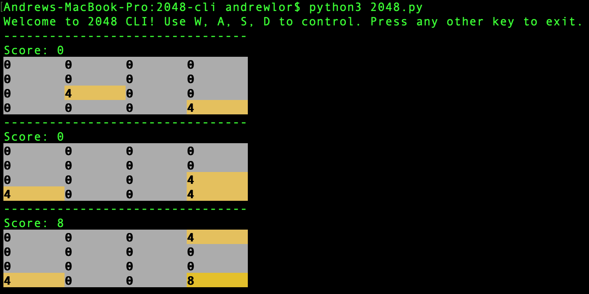

# [2048](https://en.wikipedia.org/wiki/2048_(video_game)) CLI

## Install
Requires at least python3.4, numpy, readchar
```
pip3 install numpy readchar
```

## Usage
### Play
```
python3 2048.py
```



### Simulation
You can also write/run simulations. Take a look in the `/algos` directory to see how it works. Then run the `run_simulation` script from the repo root.
```
chmod u+x run_simulation
./run_simulation random
Starting simulation...
--------------------------------
Score: 1288
8	4	8	4	
16	8	32	2	
8	64	128	16	
4	16	32	2	
Simulation complete.
```